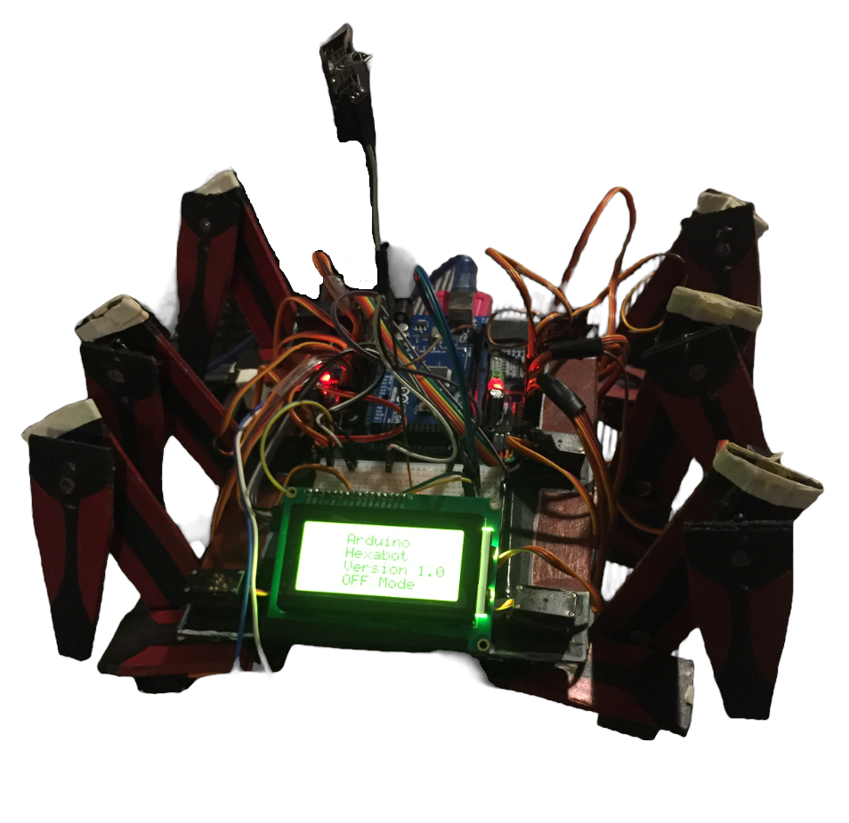

# hexapod

## Parts used.

* Servo motor      - 18
* Servo controller - 2
* Arduino Mega     - 1
* LCD Display      - 1
* Remote and Reciever - 1
* Home made structural parts using hardboard.

## Final Build

